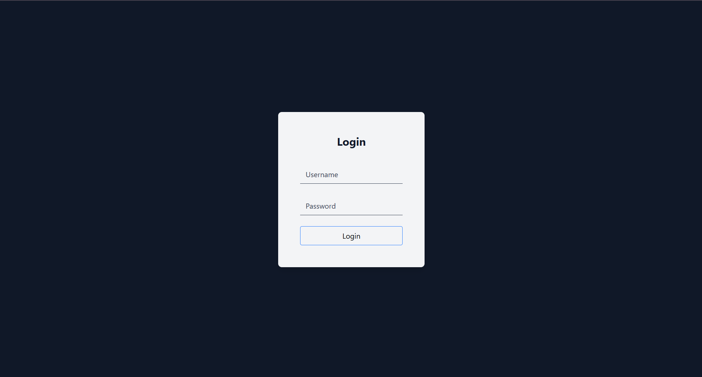
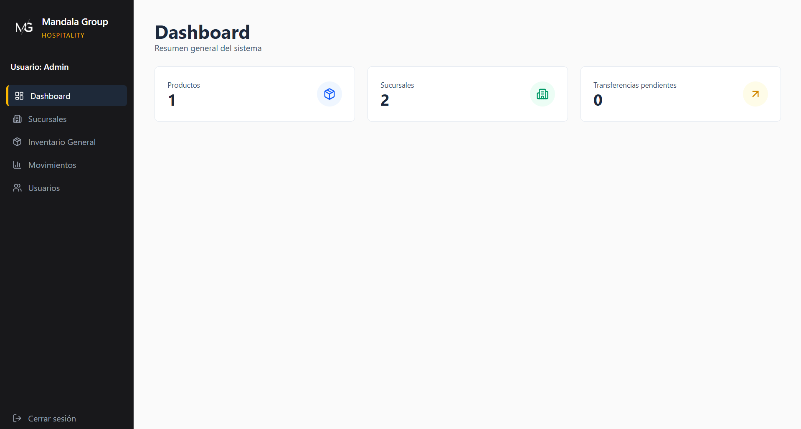
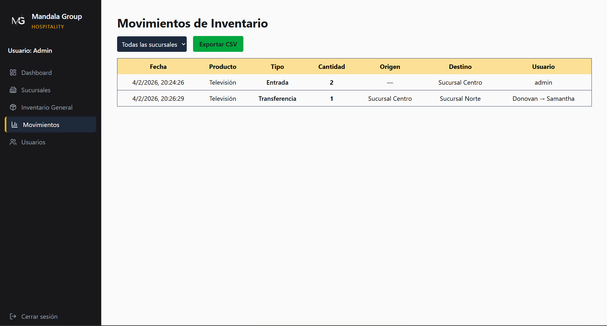

# Sistema de Inventario con Transferencias

Este proyecto consiste en un sistema web para la administración de inventario entre diferentes sucursales.  
Permite iniciar sesión con distintos roles, gestionar productos, controlar existencias y realizar transferencias de inventario entre sucursales.

Fue desarrollado como parte de una práctica académica con el objetivo de aplicar conceptos de desarrollo fullstack, conexión a base de datos en la nube y manejo de autenticación.

## Tecnologías utilizadas

Frontend:
- React
- Vite
- Tailwind CSS

Backend:
- Node.js
- Express

Base de datos:
- MongoDB Atlas

Seguridad:
- JSON Web Token (JWT)
- bcrypt para encriptación de contraseñas

## Capturas del sistema

### Pantalla de inicio de sesión

### Panel de administrador

### Inventario por sucursal

### Transferencia entre sucursales

## Enlaces del proyecto

Frontend en producción:  
https://inventario-transferencias.vercel.app/

Backend (API):  
https://inventario-transferencias.onrender.com/

Repositorio en GitHub:  
https://github.com/DonovanPeredo03/inventario-transferencias

## Cómo ejecutar el proyecto

### 1. Clonar el repositorio

git clone https://github.com/DonovanPeredo03/inventario-transferencias.git

### 2. Instalar dependencias

Backend:

cd "Inventario 2.0"  
npm install  

Frontend:

cd frontend  
npm install  

### 3. Configurar variables de entorno

Dentro de la carpeta **Inventario 2.0** crear un archivo llamado `.env` con el siguiente contenido:

PORT=3000  
MONGO_URI=tu_cadena_de_conexion_de_mongodb  
JWT_SECRET=clave_secreta  

Cada usuario debe usar su propia base de datos en MongoDB Atlas.

### 4. Ejecutar el sistema

Backend:

node server.js  

Frontend:

npm run dev  

Luego abrir en el navegador:

http://localhost:5173

## Usuarios de prueba

Administrador:  
usuario: admin  
contraseña: admin123  

Usuario normal:  
usuario: Donovan  
contraseña: 123  

## Funcionalidades principales

- Inicio de sesión con control de roles  
- Registro y consulta de productos  
- Manejo de inventario por sucursal  
- Transferencias de inventario entre sucursales  
- Historial de movimientos de inventario  

## Objetivo del proyecto

El propósito de este sistema es comprender la integración completa entre frontend, backend y base de datos, así como la implementación de autenticación y control de inventario en un entorno distribuido por sucursales.

## Autor

Samuel Donovan Peredo Jiménez  
Ingeniería en Ciencias Computacionales
