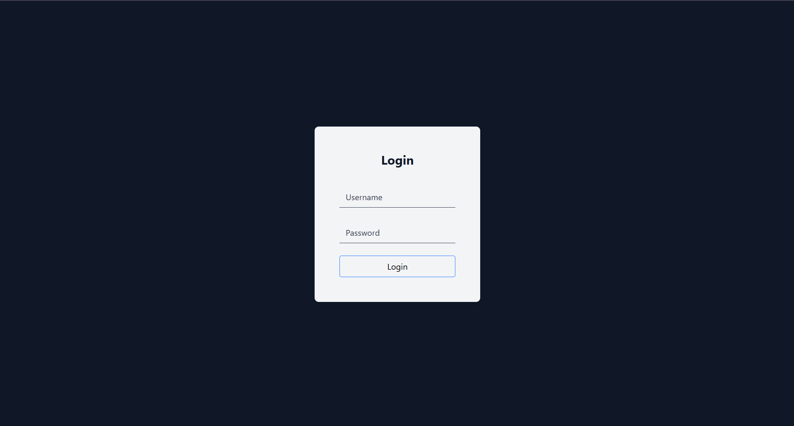
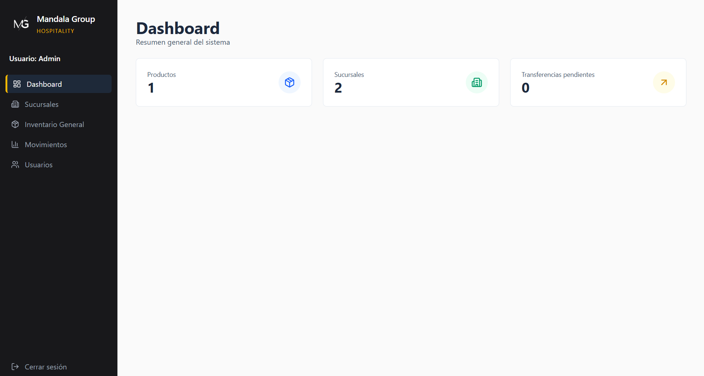
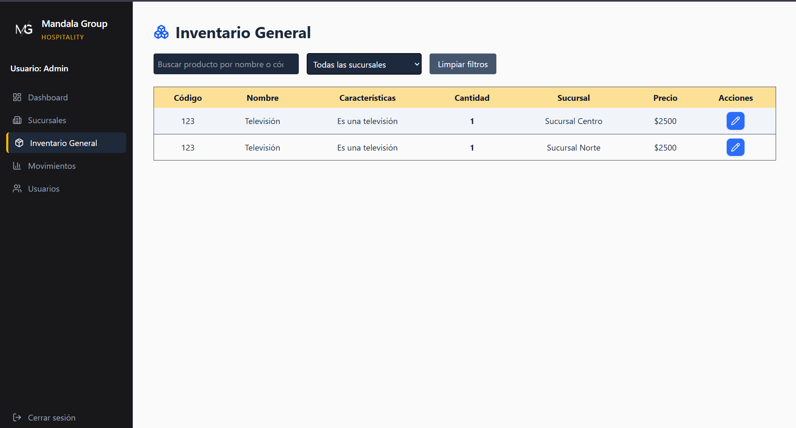
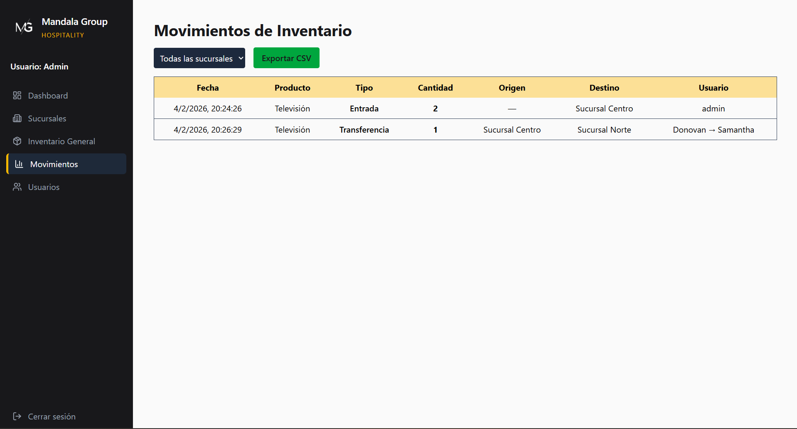

# Inventory Management System

A full-stack inventory management system developed for **Grupo Mandala** to streamline inventory operations across multiple branches.

The application provides secure authentication, role-based access control, inventory tracking, product transfers, and a RESTful API built with **Node.js**, **Express.js**, **React**, and **MongoDB Atlas**.

---

## Features

- Secure authentication using JSON Web Tokens (JWT)
- Role-Based Access Control (RBAC)
- Product management
- Multi-branch inventory management
- Inventory transfers between branches
- Inventory movement history
- Responsive user interface
- RESTful API architecture

---

## Tech Stack

| Category | Technologies |
|----------|--------------|
| **Frontend** | React, Vite, Tailwind CSS |
| **Backend** | Node.js, Express.js |
| **Database** | MongoDB Atlas |
| **Authentication** | JWT, bcrypt |
| **Deployment** | Vercel, Render |

---

## Technical Highlights

- Designed and developed a RESTful API using Express.js.
- Implemented secure authentication with JWT and password hashing using bcrypt.
- Built Role-Based Access Control (RBAC) for administrators and standard users.
- Integrated MongoDB Atlas for cloud-based database management.
- Developed reusable React components with Vite and Tailwind CSS.
- Deployed the frontend on Vercel and the backend on Render.

---

## Screenshots

### Login



Secure authentication interface with role-based access.

---

### Admin Dashboard



Administrative dashboard for managing products, users, and inventory operations.

---

### Branch Inventory



Inventory management interface for monitoring stock across multiple branches.

---

### Inventory Transfer



Transfer products between branches while keeping inventory records synchronized.

---

## Live Demo

- **Frontend:** https://inventario-transferencias.vercel.app/
- **Backend API:** https://inventario-transferencias.onrender.com/
- **Repository:** https://github.com/DonovanPeredo03/inventario-transferencias

---

## Getting Started

### Clone the Repository

```bash
git clone https://github.com/DonovanPeredo03/inventario-transferencias.git
cd inventario-transferencias
```

### Install Dependencies

#### Backend

```bash
cd "Inventario 2.0"
npm install
```

#### Frontend

```bash
cd frontend
npm install
```

### Configure Environment Variables

Create a `.env` file inside the **Inventario 2.0** directory.

```env
PORT=3000
MONGO_URI=your_mongodb_connection_string
JWT_SECRET=your_secret_key
```

> **Note:** Use your own MongoDB Atlas connection string.

### Run the Application

#### Start Backend

```bash
node server.js
```

#### Start Frontend

```bash
npm run dev
```

The application will be available at:

```
http://localhost:5173
```

---

## Demo Accounts

### Administrator

| Username | Password |
|----------|----------|
| admin | admin123 |

### Standard User

| Username | Password |
|----------|----------|
| Donovan | 123 |

---

## Project Structure

```text
inventario-transferencias
│
├── frontend/          # React + Vite application
├── Inventario 2.0/    # Express.js REST API
├── screenshots/       # Project screenshots
└── README.md
```

---

## Future Improvements

- Barcode and QR code integration
- Email notifications for inventory transfers
- Export reports to PDF and Excel
- Inventory analytics dashboard
- Real-time updates using WebSockets
- Docker containerization
- CI/CD pipeline with GitHub Actions

---

## Author

**Samuel Donovan Peredo Jiménez**

Computer Science Student  
University of Guadalajara (UDG)

**Backend Development • Data Intelligence**

- GitHub: https://github.com/DonovanPeredo03
- LinkedIn: https://www.linkedin.com/in/samuel-donovan-peredo-jimenez-16275b385/
